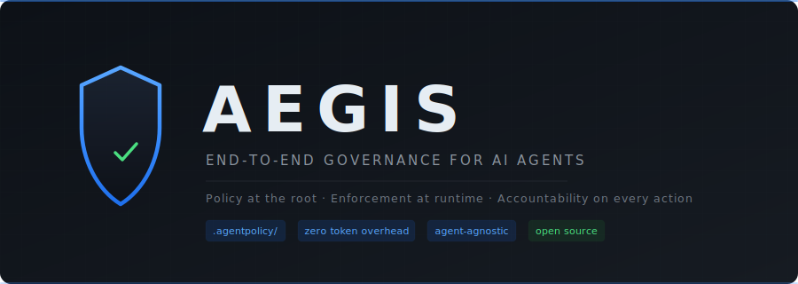

<p align="center">
  
</p>

<p align="center">
  
  
  = 18" />
</p>

<p align="center">
  <strong>The reference implementation of the <a href="https://github.com/cleburn/aegis-spec">Aegis governance spec</a>.</strong>
</p>

<p align="center">
  Run <code>aegis init</code>, have a conversation, and give every AI agent that touches your codebase a structured operating contract. Schema-validated, machine-parseable, agent-agnostic.
</p>

---

## What It Does

Aegis CLI scans your codebase, conducts a discovery conversation, and generates a complete `.agentpolicy/` directory conforming to the [Aegis governance specification](https://github.com/cleburn/aegis-spec).

You don't write policy files by hand. You talk to Aegis — it asks sharp questions about your project, your priorities, your boundaries — and compiles your answers into structured, schema-validated JSON that any agent can parse deterministically.

At the end of every session, Aegis produces a custom handoff prompt tailored to the conversation — ready to paste into your next agent session. It also configures the [Aegis MCP](https://github.com/cleburn/aegis-mcp) connection automatically so runtime enforcement is in place from the first agent session.

## Quick Start

```bash
# Install
npm install -g aegis-cli

# Start the discovery conversation
aegis init

# Have Aegis explain the current policy in plain language
aegis explain

# Validate policy files against the schema
aegis validate
```

## How `aegis init` Works

Run it in your project root. Aegis scans your repo — not just the file tree, but the actual contents of your config files, documentation, CI workflows, and project structure. By the time the conversation starts, Aegis already knows your stack, your architecture, your build pipeline, and your patterns.

If Aegis detects files that look sensitive — environment variables, credentials, database files — it skips them and tells you what it chose not to read. You decide whether it needs access.

From there, the conversation is focused and specific. Aegis doesn't ask what language you're using — it already knows. Instead, it asks about the things it can't infer from code alone:

- Your guiding principles and what's non-negotiable
- How much autonomy agents should have across different domains
- Which files are sacred and which are fair game
- How you want agents to coordinate when multiple roles are in play
- What should happen when an agent hits ambiguity or a gap in the rules

The conversation moves fast. When Aegis has the full picture, your `.agentpolicy/` directory appears — complete, schema-validated, and ready for every agent that works here next.

## What Gets Generated

| File | Purpose |
|------|---------|
| `constitution.json` | Project identity, tech stack, principles, build commands |
| `governance.json` | Autonomy levels, permissions, conventions, quality gates, escalation |
| `roles/*.json` | Scoped role definitions with collaboration protocols |
| `state/ledger.json` | Shared operational state and task tracking |
| `state/overrides.jsonl` | Append-only log of policy overrides and construction sessions |
| `sessions/*.json` | Complete session transcripts with closing guidance |
| `.mcp.json` | MCP server connection config (project root) |

The session transcript captures the full discovery conversation plus the handoff prompt, deployment intent, and file list — so you can review the reasoning behind every governance decision at any time.

## Return Visits

Run `aegis init` again in a repo that already has `.agentpolicy/` and Aegis picks up where you left off. It reads the existing policy files and prior session transcripts — it knows the full history of how governance was built and why. No full rediscovery — it asks what's changed, and updates only what needs updating.

## The Handoff

After generating policy files, Aegis displays three things:

1. **Your Handoff Prompt** — A custom prompt crafted from the conversation, ready to paste into your next agent session. For new builds, it instructs the agent to select the construction role and build in the right sequence. For return visits with changes, it describes the specific delta to apply. For existing projects getting governance, it points the agent at the right specialist role.

2. **MCP** — Confirms the MCP connection is configured and provides the install command.

3. **For All Future Sessions** — The standard prompt for every session after the initial build, ensuring agents always start by calling `aegis_policy_summary` and getting user confirmation before proceeding.

## Runtime Enforcement

The [Aegis MCP](https://github.com/cleburn/aegis-mcp) provides runtime enforcement of the governance Aegis CLI generates. The CLI automatically creates the `.mcp.json` connection config, so agents connect to the MCP on their first session without additional setup.

The MCP validates every write, delete, and execute operation against the loaded policy — zero token overhead, full audit trail. It also provides a **construction role** for initial builds, where the agent uses governance files as a blueprint but runs native tools for speed, with the session logged for auditability.

Three artifacts, one governance framework:

- [**aegis-spec**](https://github.com/cleburn/aegis-spec) — The governance standard
- **aegis-cli** — Generates the governance
- [**aegis-mcp**](https://github.com/cleburn/aegis-mcp) — Enforces the governance

## Requirements

- Node.js 18+
- An [Anthropic API key](https://console.anthropic.com/)

On first run, Aegis will prompt for your API key and store it locally.

## License

MIT

Built by [Cleburn Walker](https://github.com/cleburn) as the reference implementation of the [Aegis governance specification](https://github.com/cleburn/aegis-spec).
